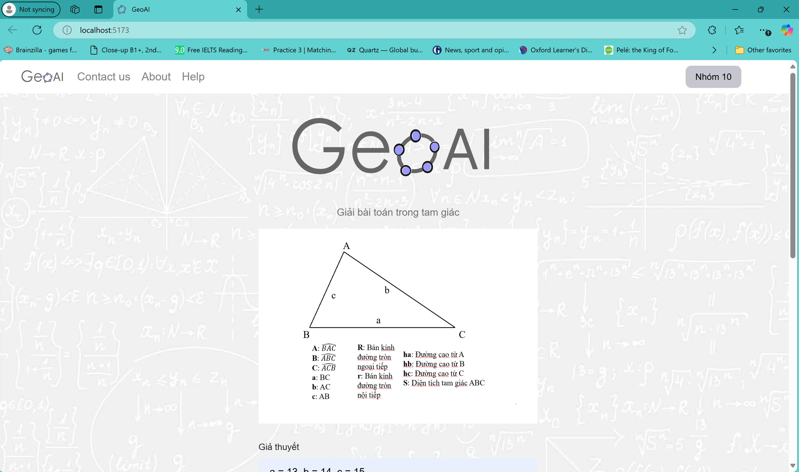
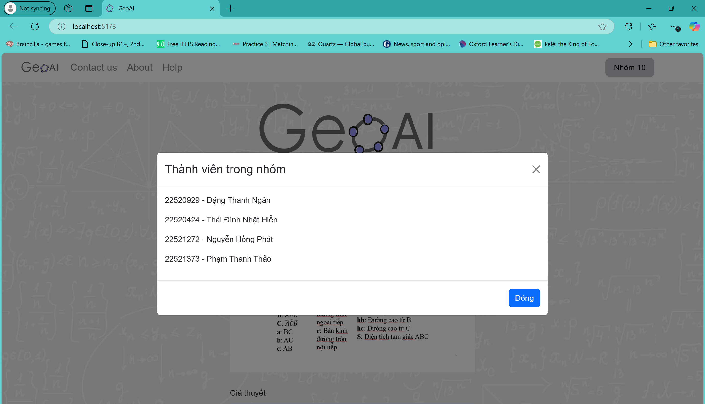
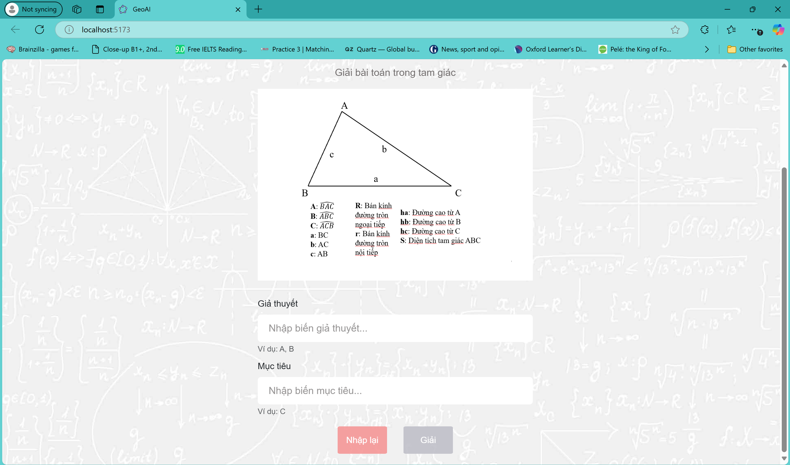
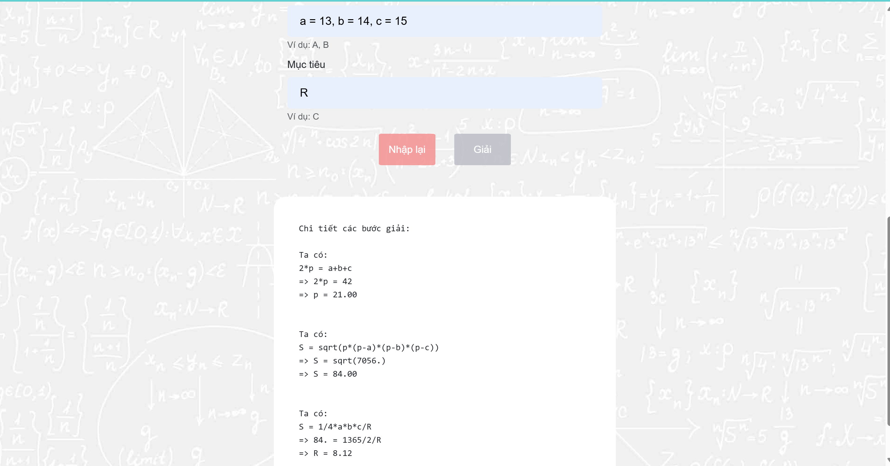

# Giải bài toán trong tam giác
## Giới thiệu
Sử dụng một số trí thức gồm cạnh và diện tích tam giác để giải những bài toán liên quan
## Công cụ sử dụng
- Maple: Giải bài toán
- Javascript, HTML, CSS: Tạo giao diện và kết nối giữa Maple và frontend
## Kết quả

